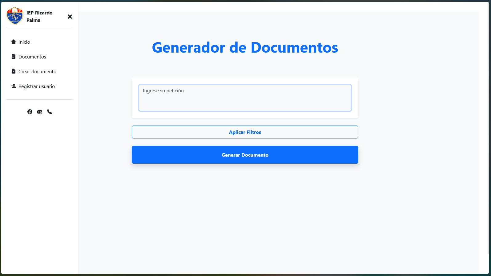
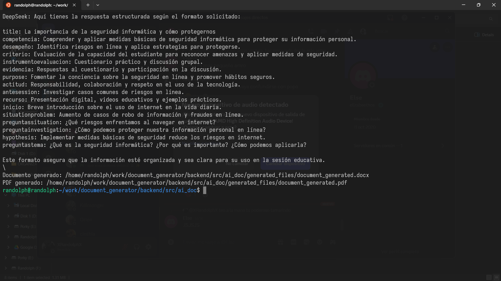
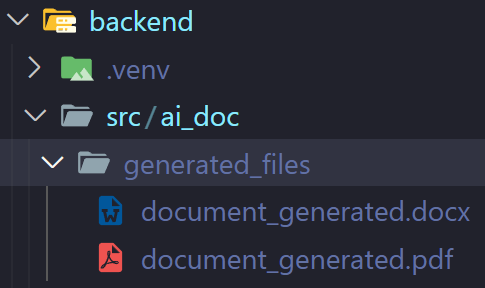
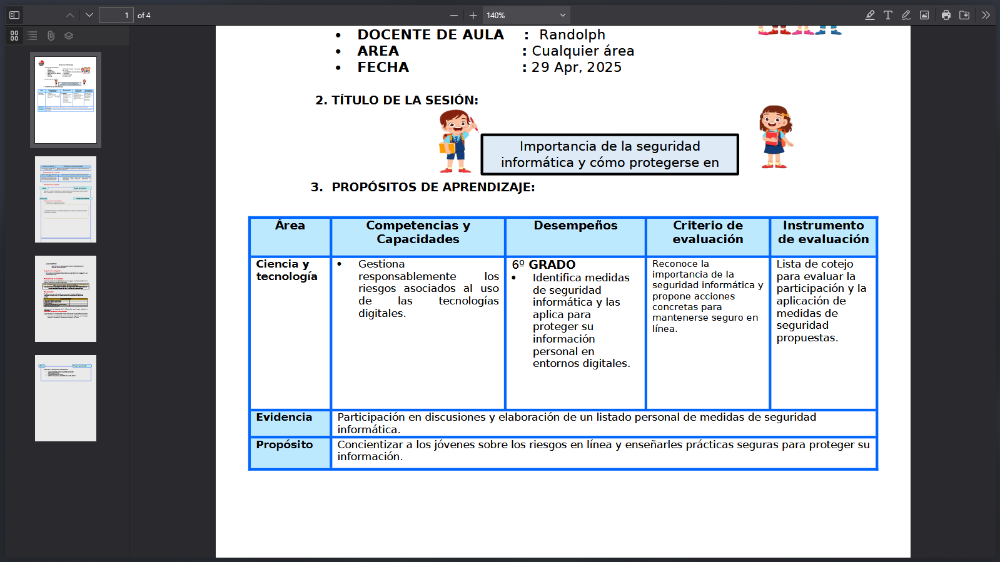
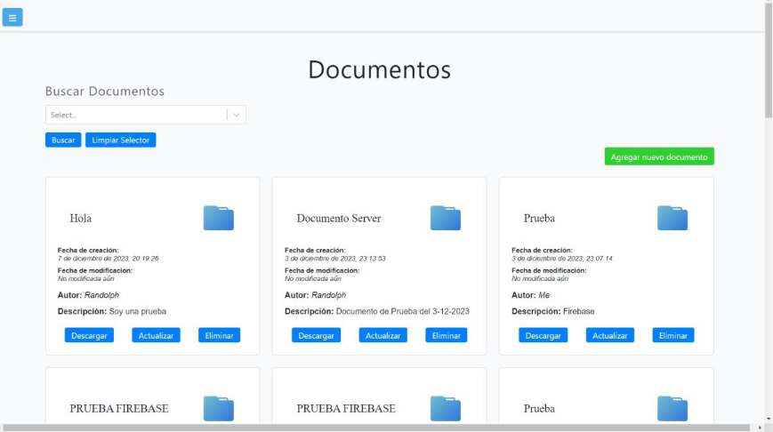

## 📚 Full Stack Project

This repository contains the **frontend** and **backend** of my application.

### Structure

- **frontend/**: Client-side code (React with Bun).
- **backend/**: Server-side code (Flask with Poetry).

---

### 🚀 Installation and Run

1. **Frontend**
   ```bash
   cd frontend
   bun install
   bun run dev
   ```
2. **Backend**
   ```bash
   cd backend
   poetry install
   ```

> **Tip**: To activate the Poetry virtual environment:
>
> ```bash
> source .venv/bin/activate  # or
> poetry env activate <env-name>
> ```

**Prerequisite for PDF conversion:**

- This project uses LibreOffice in headless mode to convert `.docx` files to PDF.
- Make sure to install LibreOffice Writer on your system:
  ```bash
  sudo apt update
  sudo apt install libreoffice-writer -y
  ```

---

### 🔧 Poetry Configuration

- **Install dependencies + project**:
  ```bash
  poetry install
  ```
- **Install only dependencies**:
  ```bash
  poetry install --no-root
  ```

By default, Poetry stores venvs in `~/.cache/pypoetry/virtualenvs/`. To generate the venv inside your project:

```bash
poetry config virtualenvs.in-project true
poetry env remove <cache-env-name>  # remove cached env if exists
poetry install
```

---

### 🔒 Environment Variables

Create a `.env` file at the root of **backend** with your API key:

```
API_KEY=<your_api_key>
```

I recommend getting your API_KEY from [OpenRouter](https://openrouter.ai).

---

### 🗂 Document Templates

To use Word document generation:

1. Create a **template/** folder inside **backend**.
2. Place your `.docx` template file into **backend/template/**.

---

### 📸 Screenshots









<!--  -->
